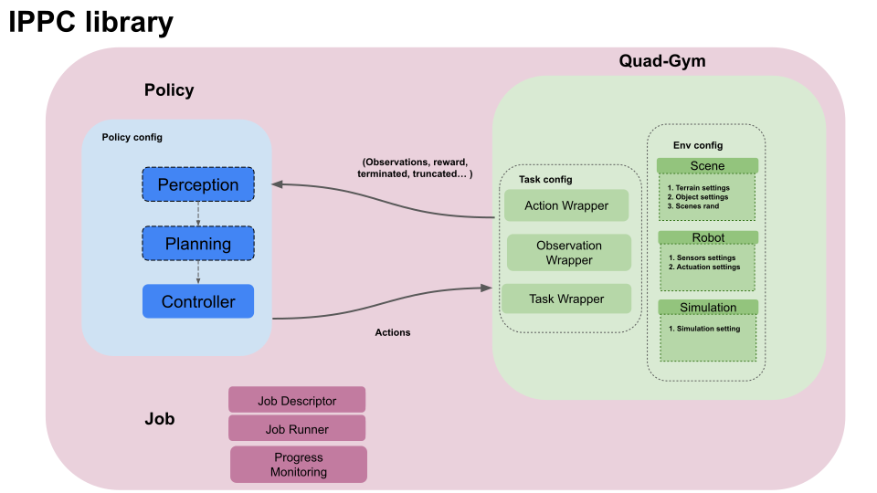
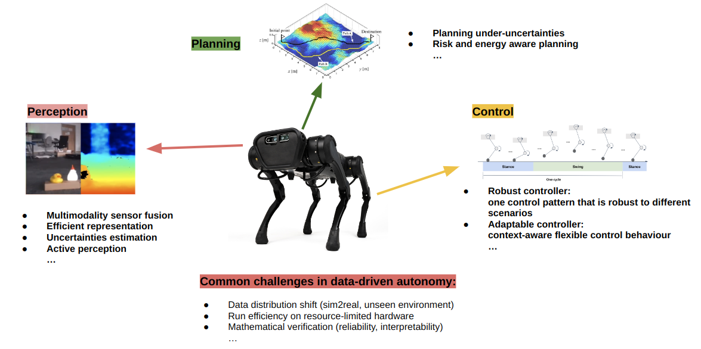

<!-- PROJECT LOGO -->
<br />
<p align="center">
  <h1 align="center"> IPPC: Integration of Perception, Planning and Control <br /> for Quadruped Robot </h1>
  <p align="center">
    <br />
  </p>


## Overview
The motivation of building this library is to bring submodules, such as perception, planning and control together to realize system-level intelligence. 
This repository contains a comprehensive library for simulating quadruped robots under various scenarios using Pybullet. 
The library also provides off-the-shelf solutions for perception, planning and control, as well as ROS communication tools for real-world deployment and distributed training.


<p align="center">
  <p align="center">
    <br />
  </p>
  <p align="center">
    <p style="text-align: center; font-size: 1em">The picture depicts a modularized design of data-driven components for an intelligent autonomous robot. 
    </figcaption>
    </p>
  </p>


## Code Structure
<p align="center">
  <p align="center">
    <br />
  </p>
  <p align="center">
    <p style="text-align: center; font-size: 1em">The figures show the structure of configurations. 
    </figcaption>
    </p>
  </p>

```
|-- IPPC
    |-- images
    |-- config
    |-- data
        |-- Perception
            |-- bev
    |-- job
    |-- policy
        |-- perception
        |-- planning
        |-- control
            |-- drl
            |-- mpc
    |-- quad_gym
        |-- env
        |-- task
        |-- wrapper
    |-- utils
    |-- log
```

## Preparation
Clone this repository: 

```Shell
git clone https://github.com/HP-CAO/IPPC.git
cd IPPC
```

Install requirements in a virtual environment (Tested on anaconda/miniconda environment with python 3.8.0, GPU with CUDA >=9.2):

```Shell
conda create --name ippc python==3.8.0
```

```shell 
pip install -e .
```
Move mpc solver to mpc directory for the use of mpc controller

```shell
mv mpc_osqp.xxxxxxxxx policy/control/mpc/.
```

## Set up interface for real robot deployment

Install dependencies `Boost` and `LCM`:

```bash
sudo apt install libboost-all-dev liblcm-dev
```

Compile the interface:
```bash
cd third_party/unitree_legged_sdk
mkdir build && cd build
cmake ..
make
mv robot_interface* ../../../quad_A1
```

## Run

### Test environment

```shell
python ./job/env_test.py config/test_env_simple.json
```
Configurations can be modified in the .json file

### Forward walk using MPC. 
To use MPC, the solver mpc_osqp is required.

```shell
python ./job/mpc_walk_forward.py config/mpc_walk_forward.json
```

### Forward walk using DRL. 

```shell
python ./job/drl_walk.py config/drl_walk.json
```
To monitor the training process

```shell
tensorboard --logdir ./runs
```


### A More Detailed Doc is Coming Soon

### Demo

## Citation

If you find our work useful in your research, please cite:

```BiBTeX

```

## Acknowledgements
This repo is built based on the amazing work [locomotion_simulation](https://github.com/yxyang/locomotion_simulation.git) by 
Yuxiang Yang and [vision4leg](https://github.com/Mehooz/vision4leg.git) by Ruihan Yang and Minghao Zhang.


